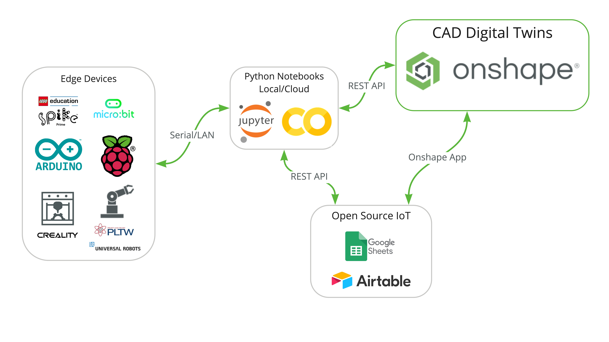

<h2>DX Onshape</h2>
This page is meant to share ways that Onshape can be used for more than traditional mechanical design. Most of this work uses the  in Google Colab or Jupyter Notebooks.

            

<h3>Local Setup</h3>
In order to communicate with edge devices through python notebooks, you will need to run the notebook on a local runtime. This means you can either run the notebook direclty in <a href="https://jupyter.org/install">Jupyter Notebooks</a>, or you can  to run the notebook through Colab on your local runtime.

 

<h2>Serial Connections</h2>
Below are examples using serial connections to edge devices plugged into your computer.
<h4></h4>
<iframe width="560" height="315" src="https://www.youtube.com/embed/Z0HO4WPtZZ0" title="YouTube video player" frameborder="0" allow="accelerometer; autoplay; clipboard-write; encrypted-media; gyroscope; picture-in-picture" allowfullscreen></iframe>
 
 
<h4></h4>
<iframe width="560" height="315" src="https://www.youtube.com/embed/bZ5IoCWHz4M" title="YouTube video player" frameborder="0" allow="accelerometer; autoplay; clipboard-write; encrypted-media; gyroscope; picture-in-picture" allowfullscreen></iframe>

 